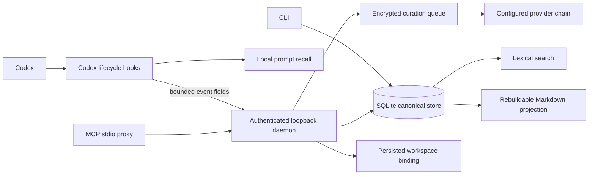

# Talaria-Mem


Talaria-Mem is a local-first, workspace-scoped memory service for Codex. The
current checkout is an unreleased automatic-memory implementation: one Go
binary, a SQLite-canonical store, a rebuildable Markdown projection, bounded
prompt-time recall, and an encrypted asynchronous curation queue. Inference is
explicitly configured; the default uses the host Codex app-server with Luna
high reasoning, while local/OpenAI-compatible providers may be selected or
ordered as fallbacks.

Licensed under the [MIT License](LICENSE).

> **Status:** this is an unreleased v0.0.2 checkout. The local installation
> path is documented, but native release artifacts, supported host-service
> installers, and full process-level egress evidence remain open. Read
> [implementation status](docs/IMPLEMENTATION_STATUS.md) before treating it as
> a release.

## Start here

- [Local deployment runbook](docs/LOCAL_DEPLOYMENT.md): complete source-build,
  setup, daemon, hook, MCP, smoke-test, and troubleshooting path.
- [Implementation status](docs/IMPLEMENTATION_STATUS.md): current surfaces,
  evidence, and known gaps for this checkout.
- [Roadmap](ROADMAP.md): deferred capability and hardening work.
- [OpenAPI contract](api/openapi/README.md): loopback HTTP contract and
  generation workflow.

## What it does

Talaria-Mem gives Codex a local memory layer for durable context that a person
chooses to keep: decisions, procedures, failures, and standing instructions.
Memories belong to a workspace, can be managed through the CLI or MCP, and can
be loaded into Codex at `SessionStart` after explicit confirmation.

It never stores full transcripts, tool inputs, credentials, or model reasoning.
Automatic and inline curation create `generated` memories that are searchable
and recallable but remain labeled and cannot become standing instructions or
pinned context until a person confirms them. Provider calls happen only through
the configured Codex or OpenAI-compatible adapter.

## How it works



- SQLite is the canonical store. Markdown is an owner-only, rebuildable
  projection.
- Writes start unverified. Explicit CLI confirmation creates a new verified
  revision; only active, verified, non-quarantined memories are eligible for
  search and SessionStart context.
- The SessionStart hook keeps the bounded event fields needed to resolve a
  workspace and never opens, stores, or logs `transcript_path`.
- Search is lexical; no embedding index or local model is required.

## Is it safe?

The security boundary is local and single-user. The implementation has several
fail-closed controls, but it is not an encrypted, multi-user vault and is not a
finished release. Use the table below as the threat-model summary:

| Area | What the implementation does | What it does not guarantee |
|---|---|---|
| Data locality | Storage, hooks, recall, and MCP stay local; curation payloads are bounded, encrypted at rest, and erased after completion/terminal refusal. | Configured inference may send sanitized snapshots to the selected provider; choose a loopback-only chain for local inference. |
| Network access | The daemon binds to literal loopback, requires a bearer token, rejects forwarding headers and credential query/cookie channels, and bounds requests. Compatible providers disable proxies and redirects and require HTTPS except literal loopback. | It is not a remote or multi-user service. A process that can read the local token or act as the same OS user is inside the host trust boundary. |
| Filesystem | State, config, backups, and projections use owner-only directories/files; symlinks and unsafe ownership/modes fail closed. | SQLite and Markdown are not application-encrypted at rest. Protection depends on the OS account and filesystem permissions. |
| Memory trust | Writes start unverified; explicit CLI confirmation is required for verified retrieval. Betterleaks scans declared content boundaries and fails closed on findings or scanner uncertainty. | A scanner is a guardrail, not proof that content contains no secret or prompt injection. Review content before confirming it. |
| Hook content | The hook forwards only bounded event fields, never opens `transcript_path`, and wraps returned memory as an untrusted reference. | The reference markers do not sandbox instructions inside memory content. They are not a prompt-injection defense. |

## Prerequisites

- Go 1.26 or newer.
- `curl` if the SessionStart hook will be used.
- macOS or Linux for the documented local journey. Other platforms are not
  verified yet.
- An existing owner-controlled `$HOME/.codex` directory without group/world
  write bits for automatic hook registration; use `--codex-hooks` for another
  JSON registry.
- Put `$HOME/.local/bin` on `PATH` if the binary is installed there.

## Deploy locally

This checkout is deployed from source, not from a packaged native artifact.
The shortest path is: build the binary, inspect the setup dry-run, apply the
installation, start the daemon, verify `/healthz`, then create a workspace and
confirm one memory. The complete copy-paste runbook, service recipes, and
troubleshooting path are in [docs/LOCAL_DEPLOYMENT.md](docs/LOCAL_DEPLOYMENT.md);
the open consumer-install work is in [docs/TASKS.md](docs/TASKS.md).

Build outside the source tree and inspect the machine-readable setup plan:

```sh
mkdir -p "$HOME/.local/bin"
go build -o "$HOME/.local/bin/talaria-mem" ./cmd/talaria-mem
export PATH="$HOME/.local/bin:$PATH"
talaria-mem setup codex --dry-run --json
talaria-mem setup codex --apply --json
```

The default private root is `$HOME/.talaria-mem`, containing `state/`,
`config/`, and `backups/`, all owner-only. First-install setup creates only
those managed directories during a dry-run; it does not create credentials,
configuration, or the hook. Apply creates the root key, bearer token, managed
setup metadata, one generic executable hook at
`$HOME/.talaria-mem/config/codex-hook.sh`, all four managed Codex lifecycle
groups, one `talaria_mem` MCP entry, and the default `providers.toml` when
absent. Re-running apply is idempotent and preserves other Codex configuration.
The `.codex` directory must already exist; use
`--codex-hooks /absolute/path/hooks.json` for another JSON registry. Removal
requires the recorded fingerprint and preserves unrelated files:

```sh
fingerprint='paste-the-64-character-fingerprint-from-dry-run-here'
talaria-mem setup codex --remove \
  --fingerprint "$fingerprint" \
  --apply --json
```

The hook registration is limited to the official JSON hook registry. Setup does
not start a daemon or install a LaunchAgent/systemd unit. Start the daemon
explicitly in a second terminal. Never print or commit `root.key` or `token`.

### Provider configuration

The absent-only default is Codex Luna-high:

```toml
version = 1
enabled = true
chain = ["codex"]

[providers.codex]
type = "codex"
model = "gpt-5.6-luna"
reasoning_effort = "high"
command = "codex"
timeout = "90s"
```

For local-only inference, replace the chain with a literal-loopback
OpenAI-compatible endpoint. Add Codex or another compatible provider to the
`chain` only when fallback is desired. Credentials may reference one captured
environment variable or one owner-only `0600` file; they are never included in
status, doctor, TOML registration, or process arguments.

For isolated runs, either leave all three path variables unset to use the
default root, or set `TALARIA_STATE_DIR`, `TALARIA_CONFIG_DIR`, and
`TALARIA_BACKUP_DIR` together to absolute canonical managed directories.
Normal commands require those directories to already exist, be owner-owned,
mode `0700`, and not be symlinks. See the [local deployment
runbook](docs/LOCAL_DEPLOYMENT.md) and the [generated environment
contract](internal/lifecycle/environment.md).

## Start and verify

Run the daemon in one terminal when using HTTP, MCP, or the hook:

```sh
talaria-mem daemon --foreground
```

In another terminal, verify the loopback daemon before creating a workspace:

```sh
curl --fail --noproxy '*' http://127.0.0.1:7437/healthz
```

The check must return HTTP 200 and JSON containing `"status":"ok"`. Then use
the same binary to create and inspect local memories:

```sh
talaria-mem workspace create --name my-repo
talaria-mem workspace list
talaria-mem workspace bind --key path:/absolute/path/to/repo --workspace my-repo

add_json=$(talaria-mem memory add --workspace my-repo --kind state --title "..." --content "..." --json)
memory_id=$(printf '%s' "$add_json" | sed -n 's/.*"MemoryID":"\([^"]*\)".*/\1/p')
revision_id=$(printf '%s' "$add_json" | sed -n 's/.*"RevisionID":"\([^"]*\)".*/\1/p')
[ -n "$memory_id" ] && [ -n "$revision_id" ] || { echo 'memory add did not return IDs' >&2; exit 1; }
confirm_json=$(talaria-mem memory confirm --memory "$memory_id" --expected-revision "$revision_id" --json)
# Confirmation creates a new revision; use its RevisionID for later writes.
revision_id=$(printf '%s' "$confirm_json" | sed -n 's/.*"RevisionID":"\([^"]*\)".*/\1/p')
[ -n "$revision_id" ] || { echo 'memory confirm did not return a revision ID' >&2; exit 1; }
talaria-mem memory search --workspace my-repo --query "..."
talaria-mem memory get "$memory_id" --workspace my-repo
talaria-mem memory forget --memory "$memory_id" --expected-revision "$revision_id"
talaria-mem status
talaria-mem doctor
```

The CLI manages local state directly; daemon mode is the authenticated loopback
surface for HTTP, MCP, and hooks.
Writes are unverified by default. Only the explicit CLI trust workflow can
make a memory verified; MCP and import do not provide a verified override.
Betterleaks scans content at each declared input/output boundary. Findings or
scanner uncertainty fail closed and do not return memory content.

## Hooks, recall, and local interfaces

The generic hook routes `SessionStart`, `UserPromptSubmit`, `PreCompact`, and
`SessionEnd` to versioned authenticated control endpoints. It retains only
bounded typed fields; `transcript_path`, tool payloads, and unknown fields are
discarded without opening the transcript. UserPromptSubmit performs bounded
local recall before returning and queues every tenth prompt; PreCompact and
SessionEnd queue source capture without waiting for inference. Generated recall
is explicitly labeled unconfirmed historical context.

MCP is registered as `talaria-mem mcp proxy`, an authenticated stdio bridge to
the loopback Streamable HTTP daemon. `memory_curate_inline` accepts one selected
candidate without a provider call and the server assigns generated trust.
MCP and control routes require a bearer token and literal loopback access.
`/healthz` is the unauthenticated liveness endpoint; `/readyz` and control
routes are authenticated.

## Available maintenance commands

The currently composed maintenance commands are:

```sh
talaria-mem db backup reconcile --dry-run
receipt='/absolute/path/to/receipt.json' # use the path printed by --dry-run
talaria-mem db backup reconcile --apply "$receipt"
talaria-mem doctor --repair=fts --dry-run
```

`memory forget` is an explicit expected-revision mutation, not a global-lock
maintenance receipt. The CLI exposes help for database restore and scanner-rule
upgrade, but those runtime operations still fail closed as unavailable; they
are tracked in [IMPLEMENTATION_STATUS.md](docs/IMPLEMENTATION_STATUS.md).

## Verification

Run the repository gates. `make check` runs the tests, race detector, vet,
generation checks, OpenAPI lint, and source-tree checks together:

```sh
make test
make test-race
make openapi-lint
make check
```

Only configured inference adapters may egress. A cold build/gate cache may
still download pinned repository verification tools; once cached, the commands
are repeatable without that download.

The G00–G30 catalog and traceability files describe the intended acceptance
protocol. Existing receipt artifacts are historical evidence, not a release
claim for this untagged checkout. See [IMPLEMENTATION_STATUS.md](docs/IMPLEMENTATION_STATUS.md)
before treating a capability as end-to-end available.

## Deliberate boundaries

This implementation has no full-transcript ingestion, semantic embeddings,
automatic Markdown synchronization, multi-user service, or automatic database
eviction. Provider topology remains user-owned and fallback is fail-closed
after scanner refusal, invalid output, policy refusal, suspicious content, or
persistence failure. Deferred work is recorded in [ROADMAP.md](ROADMAP.md).
