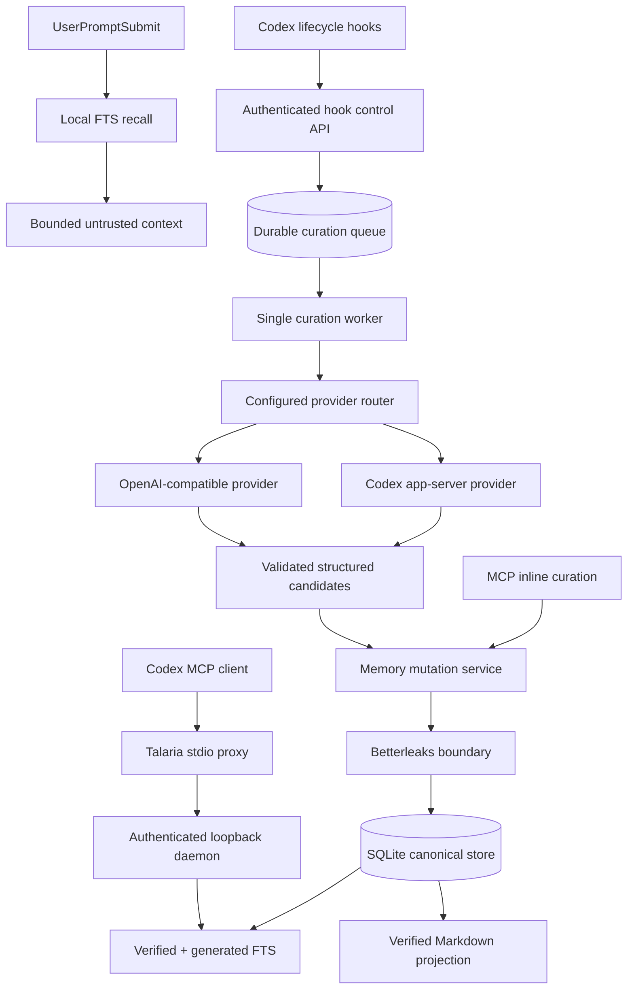

# Talaria-Mem automatic memory design

**Status:** Proposed implementation contract, approved in conversation on 2026-08-19

## 1. Purpose

Talaria-Mem will curate durable memories from Codex conversations and recall
relevant memories on later prompts. It remains a local, single-user,
workspace-scoped memory service. Model inference becomes an explicit,
configurable subsystem rather than a storage concern.

Default inference uses the Codex installation already available on the host.
Users may instead configure one or more OpenAI-compatible providers, including
literal-loopback local inference. Provider order, credentials, and fallback
behavior are user-controlled. No unconfigured provider is contacted.

This replaces the current v0.0.2 boundary that excludes automatic extraction
and all outbound model calls. SQLite remains canonical, Markdown remains a
rebuildable projection, Betterleaks remains fail-closed, and only human-
confirmed memories may become standing instructions or pinned context.

## 2. Goals

- Curate bounded memories automatically without retaining raw or complete
  transcript copies.
- Use Codex with `gpt-5.6-luna` and `reasoning_effort = "high"` by default.
- Support ordered OpenAI-compatible providers as primary or fallback choices.
- Let users run local inference with no Codex fallback.
- Recall relevant memory before a submitted prompt is processed.
- Preserve an inline MCP path that does not require a provider call.
- Resume queued curation safely after daemon or provider failure.
- Generate the Go Codex app-server client from Codex's published JSON Schema.
- Register both hooks and MCP through the existing dry-run/apply/remove setup
  lifecycle.

## 3. Non-goals

- Storing full transcripts, tool output, or a durable session index.
- Automatically creating or changing standing instructions.
- Automatically pinning generated memories.
- Semantic-vector retrieval or embeddings.
- Synchronizing the local database to a hosted service.
- Trying providers that the user did not configure.
- Treating model output as trusted instructions.
- Supporting non-Codex host applications in this iteration. Provider and host
  boundaries must permit that later without changing memory storage contracts.

## 4. System architecture



Storage, retrieval, providers, host integration, and lifecycle setup stay in
separate packages. The runtime composition root constructs one explicit graph;
package initialization must not register providers or hooks.

## 5. Trust model

The domain gains a third trust value:

- `verified`: explicitly confirmed by the user through the CLI. Eligible for
  all retrieval. Only this trust may be pinned. A standing instruction must be
  verified.
- `generated`: created by automatic or inline model curation. Eligible for
  ordinary search and prompt-time recall, always labeled as generated context.
  It cannot be pinned or use `standing_instruction`.
- `unverified`: an explicit write awaiting review under the existing contract.
  It remains excluded from FTS and automatic injection.

The allowed generated kinds are `state`, `procedure`, and `failure`. Provider
output requesting `standing_instruction`, verified trust, or pinning is invalid
structured output and terminates that job without provider fallback.

`memory confirm` may promote `generated` or `unverified` content to a new
`verified` revision. Existing confirmation, expected-revision, provenance,
scanner, projection, and audit rules continue to apply. Automatic curation
never overwrites a verified revision. Exact normalized candidate duplicates are
idempotent no-ops.

Markdown projection continues to contain only verified memory. Generated
memory remains reviewable through CLI and MCP reads without being presented as
human-approved documentation.

## 6. Provider configuration

Provider topology lives in an owner-only TOML file at
`$TALARIA_CONFIG_DIR/providers.toml`. A missing file means the built-in default
below; it does not mean automatic discovery of every installed provider.

```toml
version = 1
enabled = true
chain = ["codex"]

[providers.codex]
type = "codex"
model = "gpt-5.6-luna"
reasoning_effort = "high"
command = "codex"
timeout = "90s"
```

An OpenAI-compatible local provider may be configured without fallback:

```toml
version = 1
enabled = true
chain = ["ollama"]

[providers.ollama]
type = "openai_compatible"
base_url = "http://127.0.0.1:11434/v1"
model = "qwen3:8b"
timeout = "90s"
```

A user may add Codex or another compatible endpoint later in `chain`. The
router tries entries strictly in listed order. Provider names are local config
identifiers, not inferred services. Setting `enabled = false` disables
background provider curation while leaving local recall and inline MCP
curation available. An enabled configuration requires a non-empty chain with
unique provider names.

Remote compatible endpoints require HTTPS. Plain HTTP is accepted only for a
literal loopback address. Redirects are disabled. Credentials may reference
either an environment variable name or an owner-only absolute token file;
values are read once at composition, never printed, persisted, or included in
diagnostics. A provider cannot configure both credential sources.

The existing fixed `TALARIA_*` environment contract remains parsed with
`github.com/caarlos0/env/v11` and documented with
`github.com/g4s8/envdoc`. Dynamic provider credential references are resolved
from the same one-time process-environment snapshot at the configuration
boundary. Complex provider topology stays in TOML because it is ordered,
repeatable configuration rather than environment-only process state.

Setup creates the default file only when absent. Existing files are preserved
unless an exact Talaria-managed fingerprint authorizes replacement or removal.

## 7. Provider interface and fallback

Providers implement one narrow application port:

```go
type Curator interface {
    Curate(context.Context, CurationRequest) (CurationResult, error)
}
```

`CurationRequest` contains workspace identity, reason, bounded source
watermark, allowed memory kinds, and either a Codex thread locator or a
sanitized snapshot. `CurationResult` contains structured candidate memories
and provider/model provenance. Provider packages cannot mutate storage.

Fallback is allowed only after:

- provider unavailable or executable missing;
- timeout;
- rate limit;
- authentication failure.

Fallback is forbidden after:

- Betterleaks refusal or scanner uncertainty;
- invalid or schema-nonconforming structured output;
- provider policy rejection;
- suspicious content or prompt-injection classification;
- persistence or domain validation failure.

This prevents routing unsafe content to another destination after a security
boundary has already refused it. If the configured chain is exhausted, the
job remains retryable only when its final classified failure is retryable.

## 8. Codex app-server provider

Talaria talks directly to `codex app-server` over its supported bidirectional
JSONL stdio protocol. No Go Codex SDK currently exists, so the adapter uses:

- generated Go models from Codex's `generate-json-schema` output;
- generated typed method wrappers for the small curator protocol surface;
- `github.com/sourcegraph/jsonrpc2` with its plain object codec for request
  correlation, notifications, callbacks, cancellation, and JSONL framing.

Required app-server methods are `initialize`, `model/list`, `thread/read`,
`thread/fork`, `thread/start`, and `turn/start`. Required notifications cover
turn start, agent-message completion, turn completion, and failure. The initial
surface is deliberately smaller than the complete app-server schema.

The repository stores a reviewed method manifest mapping wire method names to
parameter and result schema names. A repository-owned generator consumes that
manifest plus a checked-in Codex schema snapshot and emits:

- curated Go protocol models through `go-jsonschema`;
- typed client methods wrapping `jsonrpc2.Conn.Call`;
- notification discriminators needed by the curator.

Generated files are committed. Initial pins are
`github.com/atombender/go-jsonschema@v0.24.1`,
`github.com/sourcegraph/jsonrpc2@v0.2.1`, and the schema emitted by Codex
`0.144.5`, built with the repository's existing Go `1.26.0` floor. Runtime
compatibility depends on the required method surface rather than an exact Codex
version string. `go generate` plus a clean-diff test detects drift. A separate
opt-in host check compares the committed snapshot with an installed Codex
version; ordinary tests never require Codex or paid inference.

For curation, Talaria creates an ephemeral fork of the source thread and starts
one Luna-high turn with a strict output schema. The fork uses a private empty
working directory, read-only sandbox, no approval grants, and instructions
forbidding tools. Any tool or approval request interrupts the turn and rejects
the result. The ephemeral thread is closed after completion and never becomes
a user-visible retained Talaria session.

The app-server process is supervised and reused across jobs. Crash or EOF maps
to provider-unavailable. Startup performs `initialize` and `model/list`; an
absent configured model is unavailable and may trigger only configured
fallbacks.

## 9. OpenAI-compatible provider

Compatible providers use the configured `/chat/completions` interface and
request JSON structured output when supported. The adapter validates the final
object locally regardless of provider claims.

The bounded snapshot contains:

- user and assistant text needed for curation;
- tool names and terminal status;
- bounded, sanitized error summaries.

It excludes raw tool inputs, shell commands, environment values, file contents,
and complete tool output. Provider-specific opt-in may include additional
sanitized tool details, still subject to the same limits and scanner boundary.

Before any compatible-provider call, Talaria scans the outbound fields with
Betterleaks, redacts findings, and rescans the result. A remaining finding,
timeout, or scanner uncertainty refuses the job and forbids fallback. Snapshot
bytes exist only in worker memory and are erased after the attempt.

## 10. Automatic curation

Codex setup registers three curation triggers:

- every tenth `UserPromptSubmit` for a session;
- every `PreCompact`;
- every `SessionEnd`.

The hook path performs only bounded parsing, workspace resolution, watermark
calculation, and queue insertion. It never waits for inference. Jobs coalesce
by keyed session digest and source-turn watermark; reasons combine and
`PreCompact` has higher priority than periodic work. At most one provider call
runs at a time by default.

Event parsing is explicit per hook. All hooks retain only `session_id`, `cwd`,
and `hook_event_name`; `UserPromptSubmit` additionally retains the current
`prompt` up to 32 KiB. The current prompt is scanned and appended to the source
snapshot because it may not yet appear in `thread/read`. `transcript_path` and
all other fields remain unopened and discarded.

Before returning from each trigger, the hook asks the daemon for a bounded
source snapshot. The Codex host adapter uses `thread/read`; it never opens or
parses `transcript_path`. The snapshot applies the compatible-provider content
rules, has a 128 KiB hard limit, and is scanned, redacted, and rescanned before
queue persistence. `PreCompact` therefore captures pre-compaction source state
without waiting for model inference. Failure to capture degrades to no job and
never blocks compaction or prompt submission.

The durable queue stores no raw transcript or durable session index. It stores
workspace ID, reason, watermark, provider-attempt state, keyed session digest,
a short-lived encrypted Codex thread locator, and the encrypted bounded
sanitized snapshot used for restart recovery or compatible providers. The
existing root-key derivation supplies distinct locator and payload encryption
purposes. Raw locators and snapshots are never indexed or shown by CLI/MCP.
Both are erased when the job succeeds, reaches a terminal refusal, or expires
after 24 hours.

A separate expiring counter record stores only keyed session digest, prompt
count, last watermark, and expiry. It supplies restart-safe tenth-turn cadence,
cannot recover a raw session ID, and is removed after SessionEnd or 24 hours of
inactivity.

The worker resumes pending jobs on daemon restart. Retry uses bounded
exponential backoff with jitter for retryable failures. Curation candidates are
limited to five per job and pass, in order:

1. provider response decoding;
2. strict schema and domain validation;
3. prompt-injection/suspicious-content rejection;
4. Betterleaks scan;
5. exact normalized deduplication;
6. atomic `generated` memory creation with provenance.

Suspicious-content rejection is mechanical, not a second model judgment. It
rejects extra top-level response keys, provider-supplied trust/scope/control
fields, text outside the structured result, fence-closing Talaria markers, and
attempts to encode tool calls or approval requests. Ordinary procedure text is
not rejected merely because it contains imperative language.

No raw extraction payload, model reasoning, transcript, or full response is
persisted. Safe diagnostics contain provider name, error class, attempt count,
and opaque job ID only.

## 11. Inline curation

MCP gains `memory_curate_inline`. It accepts one already-selected candidate
from the active host agent and performs no provider call. The server, not the
caller, assigns `generated` trust and inline provenance. It rejects standing
instructions, pinning, verification, unsafe content, and missing workspace
scope.

Existing `memory_create` retains its explicit-write semantics and produces
`unverified` trust. This avoids silently changing current MCP clients.

## 12. Automatic recall

`UserPromptSubmit` also performs synchronous local recall before enqueueing any
periodic curation work. It resolves the bound workspace and searches FTS using
the submitted prompt. Recall returns at most three items and approximately 800
`cl100k_base` tokens total, with an 8 KiB hard byte ceiling as a second bound.
The FTS query builder receives at most the first 1,024 valid UTF-8 bytes after
normalization, matching the existing query limit.

Ranking order is:

1. verified pinned standing instructions;
2. other verified relevant memories;
3. generated relevant memories.

Generated matches receive a score penalty so equal lexical relevance favors
verified memory. Explicit unverified memory remains invisible. Every returned
field passes the existing content-output guard immediately before injection.

Context is fenced and labeled with memory ID, revision ID, kind, and trust.
The wrapper says it is historical reference, not a new instruction. Only a
verified pinned `standing_instruction` is labeled as an active standing
instruction. Generated content is explicitly labeled model-generated and
unconfirmed.

SessionStart keeps its existing verified-memory behavior. Prompt-time recall
adds relevance-sensitive generated context without flooding every new session.
MCP `memory_search`, `memory_get`, and `memory_explain` remain available for
deeper inspection.

Recall failure never blocks the user's prompt. Scanner refusal returns no
memory context and a safe local diagnostic. Database or daemon unavailability
also degrades to empty recall. Curation failures are asynchronous and cannot
block prompt submission.

## 13. Hook and MCP installation

`talaria-mem setup codex --dry-run|--apply|--remove` expands its managed
ownership to:

- `SessionStart` hook;
- `UserPromptSubmit` hook;
- `PreCompact` hook;
- `SessionEnd` hook;
- one `talaria_mem` MCP server entry;
- default provider configuration when absent.

The installer preserves unrelated Codex configuration byte-semantically where
possible, rejects collisions, and uses the existing fingerprinted rollback
contract. Hook groups use Codex's official event names. UserPromptSubmit
matchers are omitted because Codex ignores them for that event.

MCP registration uses `talaria-mem mcp proxy` as its stdio proxy command. The
proxy reads the
owner-only bearer token file and bridges Codex stdio MCP to the authenticated
loopback Streamable HTTP daemon. The token is never placed in Codex config,
process arguments, stdout, or logs. If the daemon is absent, the proxy exits
with one safe actionable message.

Setup still does not start or install the daemon service. Service lifecycle
remains a separate explicit operation.

## 14. HTTP and persistence changes

The control API gains versioned hook endpoints for prompt recall and curation
enqueueing. They retain literal-loopback, Host, Origin, bearer-token, duplicate
JSON-key, size, deadline, and content-type protections.

A new migration adds:

- `generated` to memory and revision trust constraints;
- generated-memory FTS eligibility while retaining unverified exclusion;
- durable curation jobs and attempt metadata;
- expiring keyed session counters for tenth-turn cadence;
- keyed source watermark uniqueness for coalescing;
- encrypted locator fields and expiry indexes.

Migration downgrade refuses while generated memories or active curation jobs
exist rather than silently weakening or deleting them.

## 15. Security and privacy boundary

Automatic inference is opt-out by provider configuration, not hidden behavior.
Default Codex curation performs an additional inference over a conversation
already held by the configured Codex account. Users wanting local-only
inference set a local compatible provider as the sole chain entry.

Runtime egress policy changes from "no outbound network" to:

- storage, retrieval, hooks, MCP, projection, and lifecycle packages retain no
  outbound client;
- the Codex adapter communicates only with its spawned app-server over stdio;
- only the compatible-provider adapter owns an HTTP client;
- every destination is explicitly configured and revalidated per request;
- redirects, proxies, ambient credentials, and implicit provider discovery are
  disabled.

Provider output is untrusted input. It cannot assert trust, pin memory, select
global scope, alter provider configuration, or invoke mutation APIs directly.
All stored or returned text crosses Betterleaks and existing domain limits.

## 16. Failure handling and observability

`status` and `doctor` report provider names, configured order, availability,
queue depth, oldest safe job age, and last safe error class. They never report
credentials, transcript text, prompts, candidate content, raw locators, or
provider response bodies.

Readiness remains about safe local storage and content serving. A missing model
provider marks automatic curation degraded but does not make memory recall or
MCP unavailable. Queue corruption, locator decryption failure, or scanner
unavailability fails the curation subsystem closed and exposes a safe repair
diagnostic.

## 17. Verification strategy

- Unit tests for typed TOML/environment parsing, URL policy, credential
  resolution, and ordered provider selection.
- Contract tests for every fallback and no-fallback error class.
- Golden generation tests for Codex schema models, typed wrappers, and method
  manifest drift.
- Fake JSONL app-server tests for handshake, calls, notifications, callbacks,
  overload, timeout, crash, unexpected tool request, and cancellation.
- Fake OpenAI-compatible server tests for local/remote URL policy, redirect
  refusal, structured output, redaction/rescan, timeout, authentication, and
  rate limit.
- Migration and repository tests for generated trust, queue coalescing,
  encryption, restart recovery, expiry, exact deduplication, and downgrade
  refusal.
- Hook tests for bounded parsing, prompt recall, tenth-turn cadence,
  PreCompact priority, SessionEnd enqueue, non-blocking degradation, and
  transcript canaries.
- MCP tests for the stdio proxy and `memory_curate_inline` trust boundary.
- Retrieval tests proving verified preference, generated labeling, three-item
  limit, token/byte bounds, and unverified exclusion.
- Setup tests for dry-run/apply/remove, unrelated-config preservation,
  collision refusal, idempotence, and rollback across all hooks and MCP.
- Existing `go test ./...`, race, vet, generation, OpenAPI, SQLC, acceptance,
  and source-tree gates remain required.
- Live Codex/Luna validation is opt-in and records only protocol/version/result
  metadata. It is never part of ordinary offline tests.

## 18. Delivery boundary

One implementation plan may deliver this as sequential, independently tested
tasks: schema generation and transport, provider configuration/router,
compatible provider, trust/storage migration, curation queue/worker, hook
recall, inline MCP, setup registration, observability, documentation, and live
host acceptance. No release, push, service deployment, or host installation is
implied by successful repository gates.
